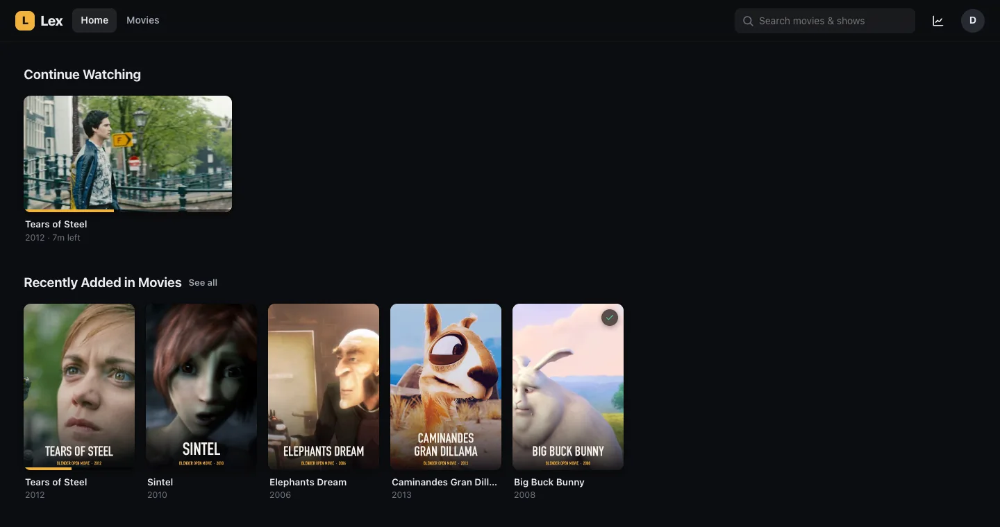
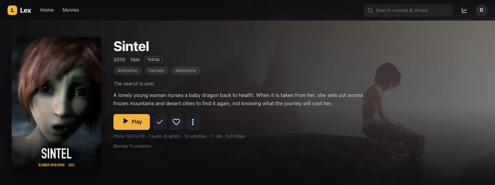
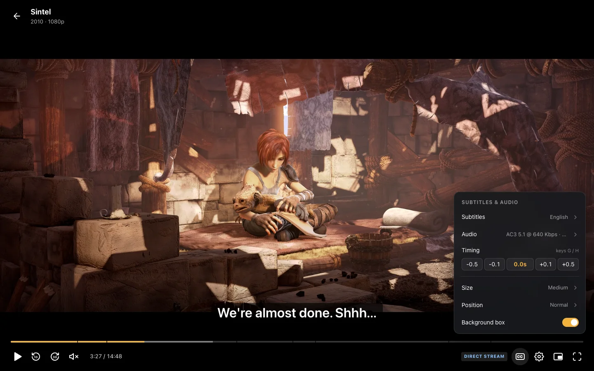
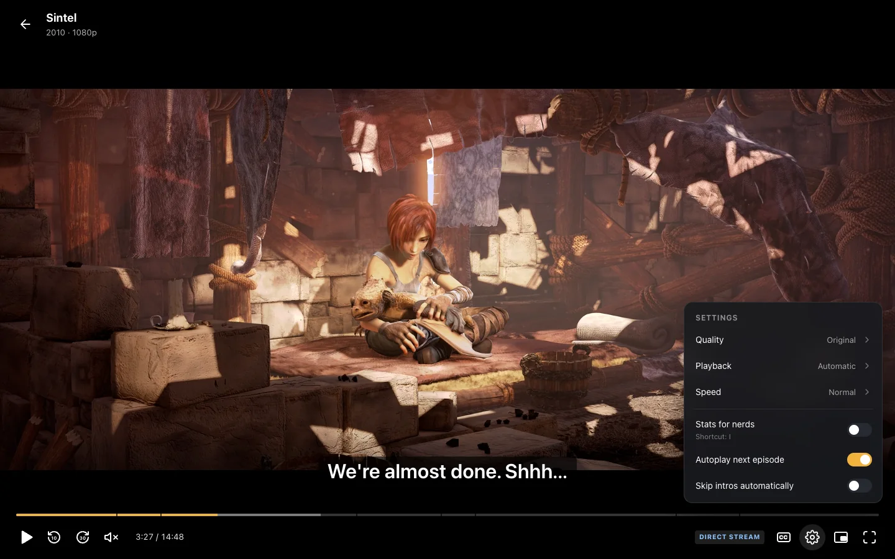
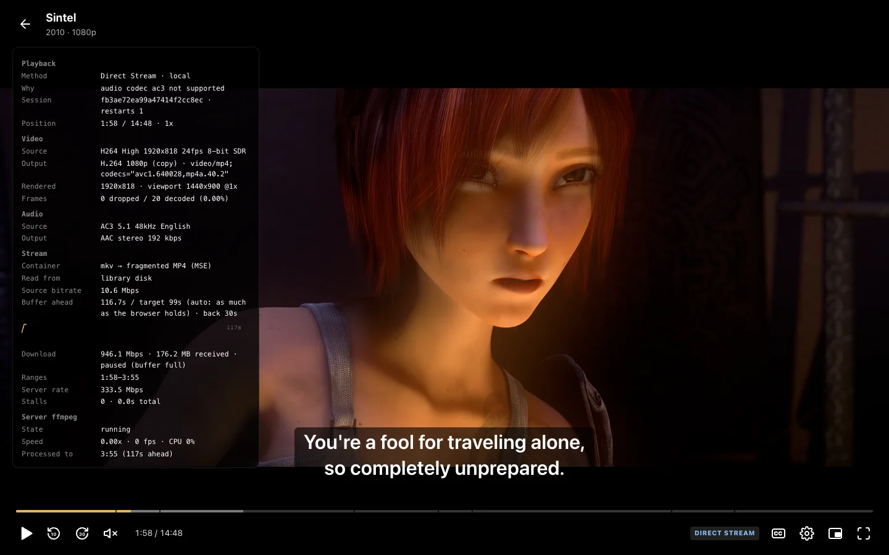
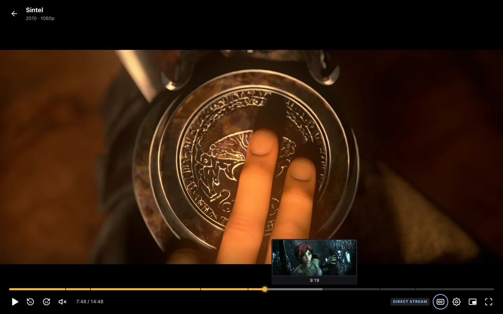
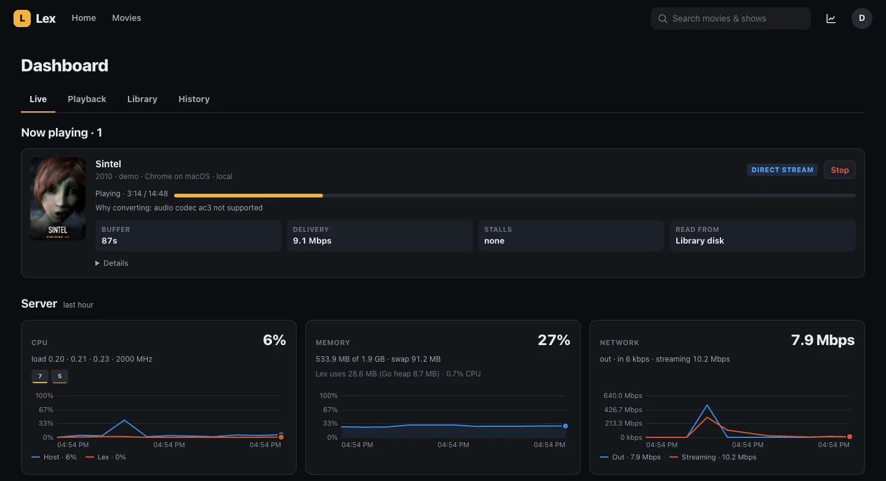
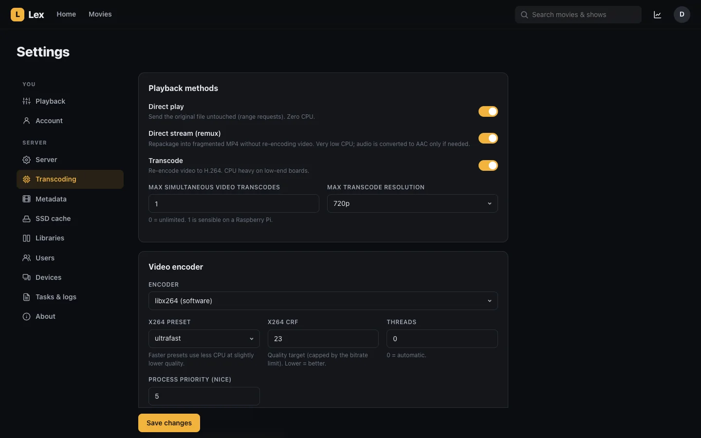

# Lex

A lightweight, self-hosted media server in the spirit of Plex / Emby / Jellyfin,
built for small Linux hosts, including Raspberry Pi. A Go binary with SQLite,
`ffmpeg`/`ffprobe` for media processing, and a dependency-free web UI embedded
in the binary. macOS can be used for local development.

> [!NOTE]
> **Built by AI.** Lex was written by large language models (LLM coding
> agents) under human direction: the code, UI, tests, documentation and
> screenshots. See [AI disclosure](#ai-disclosure).



## Screenshots

**Details** – artwork, overview, and the file's video, audio and subtitle tracks.



**Player** – subtitles & audio menu with timing offset, size and position (left);
player settings for quality, playback method and speed (right).

<p>
  
  
</p>

**Stats for nerds** – why a file is remuxed, buffer health and the server's
ffmpeg state (left); seek-bar thumbnails (right).

<p>
  
  
</p>

**Admin** – live dashboard with host load and what each stream costs (left);
transcoding settings (right).

<p>
  
  
</p>

<sub>Screenshots use the Blender Foundation's open movies *Sintel*, *Tears of
Steel*, *Big Buck Bunny*, *Elephants Dream* and *Caminandes: Gran Dillama*
(© Blender Foundation, [blender.org](https://www.blender.org/about/projects/)),
released under Creative Commons Attribution licenses. Posters and backdrops are
frames from the films.</sub>

## Features

- **Libraries** – Movies, TV Shows, or Mixed (auto-detects episodes vs films, good
  for anime folders). Release-style names (`Dune.Part.Two.2024.1080p...`,
  `The Office (US) - S06E17-E18 - ...`, `www.site.com - Title 2021 ...`) are parsed,
  plus `.plexmatch` / `.nfo` ids and local `poster.jpg` / `fanart.jpg` / `-thumb.jpg`.
  Periodic rescans only `stat` files; a Sonarr/Radarr webhook triggers instant rescans.
  Library names must be unique. A file belongs to one library: a library nested in
  another's folder lists only files the other doesn't already have, and Settings →
  Libraries says where the rest are. Editing or deleting a library rescans the
  libraries that overlap it.
- **Metadata** – TMDB (with a free API key), TVmaze for shows (no key), and a local
  **Radarr** as a keyless TMDB source for movies (auto-detected). Artwork is fetched
  lazily, cached on disk and resized for the grid. Cast portraits use the same
  server cache, so browsers do not contact image providers directly. Manual "Fix match" and refresh.
- **Playback**
  - **Direct Play**: the original file with HTTP range requests (zero CPU).
  - **Direct Stream (remux)**: ffmpeg repackages to fragmented MP4 without touching
    video; unsupported audio (EAC3, DTS, TrueHD…) becomes AAC. Performance depends on the file and hardware.
  - **Transcode**: H.264 via libx264 (or `h264_v4l2m2m`), bitrate/resolution caps,
    image-subtitle (PGS/VobSub) burn-in, optional HDR→SDR tone mapping.
  - The browser reports its codecs; the server picks the cheapest method and records
    *why* (e.g. "audio codec eac3 not supported"). If the browser fails anyway, the
    player falls back Direct Play → Direct Stream → Transcode automatically.
  - Remux/transcode output keeps the file's own timestamps and is fed to the browser
    via Media Source Extensions: seeking restarts ffmpeg at the target, and once the
    client's forward buffer is full it stops reading, TCP backpressure pauses ffmpeg,
    and nothing is written to disk.
  - **HLS** for browsers without Media Source Extensions (older iOS, some TVs,
    AirPlay) or on request: 6-second segments written to the data folder and
    deleted as playback moves on.
- **Subtitles** – embedded, external and downloaded text subtitles with size,
  position, background and timing offset (`g`/`h`); styled ASS/SSA (anime fansubs)
  rendered with libass in the browser using the file's attached fonts; search and
  download from OpenSubtitles.com (free API key); image subtitles are burned in.
  Large subtitle tracks load progressively while they're extracted.
- **Seek previews** – thumbnail sprites generated in the background from keyframes
  at the lowest priority, shown while hovering or dragging the seek bar.
- **Player** – resume, an Up next card that plays the next episode after a
  countdown (Cancel stops it for that episode), an end card for movies (Back to
  details / Play from start), subtitle/audio switching, quality & method menus,
  speed (kept until the player closes), PiP, Media Session keys, keyboard
  shortcuts (`space/k`, `←/→` or `j/l`, `↑/↓`, `f`, `m`, `c`, `i`, `n`, `s`, `g/h`, `0-9`),
  touch controls (tap to show or hide the controls, double-tap the sides to seek),
  a reconnecting notice when the server drops out, and a **stats for nerds**
  overlay (codecs in/out, reasons, buffer health graph, download speed, dropped
  frames, stalls, server ffmpeg speed/fps/CPU/throttling).
- **Interface** – a two-row player toolbar on narrow screens, keyboard-accessible
  episode playback and seek controls, labeled settings, and dialogs that contain
  focus and return it when closed. Playback actions appear before long synopses;
  empty filtered libraries offer a clear-filters action. Continue Watching cards
  have a ⋯ menu (Mark watched, Remove from Continue Watching), library grids show
  three posters a row on phones, and Random opens a random title's page. Safe-area
  insets keep controls clear of notches and home bars.
- **Dashboard** – live CPU (per core), RAM/swap, SoC temperature, clock, Pi
  under-voltage/throttle flags, network & disk I/O, storage, process memory, and every
  active stream with client buffer, bandwidth, stalls and ffmpeg state, on the Live
  tab. **Stop** ends a stream and tells the viewer it was stopped by the admin; the player does not reconnect on its own.
  The Playback tab has analytics for 7 to 365 days (watch time per day, or per week
  for long ranges; methods, stall rate by method, top titles, users, clients,
  conversion reasons, time of day; each chart's values can be shown as a table)
  and the paged play history over all time. The Library tab breaks the library down by codec,
  resolution, HDR, container and size.
- **Users** – multiple accounts, per-user watch state, admin roles (an admin can't
  change their own role), device sign-out, login rate limiting, bcrypt passwords, HttpOnly cookies, and cross-origin
  protection for browser mutations.
- **Settings** – everything above is toggleable: methods, transcode limits, encoder,
  preset/CRF/threads/nice, audio channels/bitrate, tone mapping, fragment & keyframe
  sizes, remote bitrate cap, local networks, scanning, metadata providers. Forms
  show unsaved changes and ask before you leave them. Per-device playback prefs
  (quality, method, buffer ahead/behind, languages, subtitle style, single-key
  shortcuts).

- **Media cache & intros** – optional disk cache with size/free-space limits,
  next-episode prefetch, and intro detection when FFmpeg supports Chromaprint.

## Quick start

Download the archive for your system from
[Releases](https://github.com/myNameArnav/lex/releases/latest) (Linux amd64,
arm64 and armv7; macOS; Windows), unpack it, install FFmpeg and FFprobe, and run:

```sh
./lex -addr 127.0.0.1:8420 -data ./data
```

Or build it yourself with Go **1.26.8 or newer**, from the repository root:

```sh
go build -trimpath -o lex ./cmd/lex
```

Open <http://localhost:8420>, create the first administrator, then add a library
in Settings → Libraries. Library paths must be absolute and readable by Lex.
New passwords must be 12–72 bytes. Use your own media files.

The default address is loopback. To allow trusted LAN clients, explicitly use
`-addr :8420` and configure a firewall. Complete setup before allowing other
clients to connect. See [security and privacy](SECURITY.md) before remote access.

| Flag | Environment | Default |
| --- | --- | --- |
| `-addr` | `LEX_ADDR` | `127.0.0.1:8420` |
| `-data` | `LEX_DATA` | `./data` |
| `-ffmpeg` | `LEX_FFMPEG` | `ffmpeg` |
| `-ffprobe` | `LEX_FFPROBE` | `ffprobe` |
| `-debug` | `LEX_DEBUG=1` | off |
| `-version` | — | print version and exit |
| `-healthcheck` | — | probe `/api/public/info` on `-addr` and exit |

Flags override environment settings. FFmpeg/FFprobe must be on `PATH` or supplied
as explicit paths. Debug logs can include private filenames and paths.

## Docker

Images for `linux/amd64` and `linux/arm64` (including 64-bit Raspberry Pi OS)
are published to GitHub Container Registry:

| Tag | Updated |
|---|---|
| `ghcr.io/mynamearnav/lex:latest`, `:<major.minor>`, `:<version>` (e.g. `:0.0.6`) | with each release |
| `ghcr.io/mynamearnav/lex:edge` | with every change on `main` |

```sh
docker run -d --name lex -p 127.0.0.1:8420:8420 --user 1000:1000 \
  -v lex-data:/data -v /path/to/media:/media:ro ghcr.io/mynamearnav/lex:latest
```

### Docker Compose

Edit `/path/to/media` in `docker-compose.yml` to your media directory:

```sh
docker compose up -d            # published image
docker compose up -d --build    # or build from this checkout
```

The UI is available at <http://localhost:8420>. Compose publishes port 8420 only
on loopback, mounts media read-only at `/media`, and stores application data in a
named `lex-data` volume owned by UID 1000. In Lex, add `/media` as a library path.
Back up the volume; `docker compose down -v` deletes it.

To allow LAN access, explicitly change the port mapping to `8420:8420`. Docker
uses bridge networking, so local Radarr is not available at `127.0.0.1` inside
this container: configure a reachable Radarr URL and API key in Settings.
Host network/disk statistics reflect the container's environment.

The multi-stage Dockerfile builds a static Go binary and runs as UID 1000 in
Debian trixie with FFmpeg. The container has a `lex -healthcheck` health check.
On arm64, it uses the Raspberry Pi archive for hardware-capable FFmpeg by default.
For other arm64 boards or generic software decoding:

```sh
docker build --build-arg RPI_FFMPEG=no -t lex:latest .
```

On a Raspberry Pi, review the hardware devices and group IDs in the override,
then run:

```sh
docker compose -f docker-compose.yml -f docker-compose.rpi.yml up -d
```

The override requires the listed devices to exist. Use the base configuration
for software playback if your kernel does not expose them.

## Linux service deployment

`deploy/lex.service` is a binary systemd example; `deploy/lex.container` is a
Podman Quadlet example that runs the published image with `AutoUpdate=registry`,
so Podman's daily `podman-auto-update.timer` installs new releases (enable it
with `systemctl enable --now podman-auto-update.timer`). Both bind to loopback. Review paths, permissions, device
availability, and the `video`/`render` group IDs for your host. Quadlet mounts
`/srv/media` at `/media` and `/var/lib/lex` at `/data`. Binary mode runs as the
`lex` system user and stores data in `/var/lib/lex`.

The optional deployment script requires an **explicit SSH target with root
privileges** and systemd on the destination. Container modes need Podman with
Quadlet support there; `container-local` builds the image locally with Docker
(for unreleased changes) and binary mode needs Go. It replaces the destination's existing Lex service; back up
its data and adapt the templates before using it.

```sh
# Replace the example SSH target with your configured host.
deploy/deploy.sh root@media-host arm64 container        # published image
deploy/deploy.sh root@media-host arm64 container-local  # build here and copy
deploy/deploy.sh root@media-host amd64 binary
```

The helper `deploy/lex-hwcodec.service` attempts to load Raspberry Pi codec
modules, then reloads systemd so the Quadlet unit picks up the codec devices
(Quadlet generates the unit early in boot, before they exist). Hardware configuration varies by board, kernel and distribution;
consult the board's documentation before modifying boot settings. Lex tests
available hardware at startup and can use hardware HEVC decoding and
`h264_v4l2m2m` encoding when supported. Software fallback and transcode settings
are available in the UI. Performance depends on codec, resolution and hardware.

## Remote access and webhooks

Use an HTTPS reverse proxy or a private VPN. Lex itself speaks HTTP. Keep direct
access to the backend restricted. If you enable **Trust reverse-proxy headers**,
set **Trusted proxy peers** to the proxy's exact addresses/CIDRs. The proxy must
append the client address to `X-Forwarded-For` (nginx
`$proxy_add_x_forwarded_for`, Caddy, Traefik and Cloudflare do this by default),
set `X-Forwarded-Proto`, and preserve the public `Host` header. Lex reads
`X-Forwarded-For` from the right and uses the first address that isn't a trusted
proxy peer, so list every proxy hop in a chain. `X-Real-IP` and
`CF-Connecting-IP` are ignored. Proxy trust is disabled for new installations
and its allowlist defaults to loopback.

Clients outside **Local networks** receive the configured **Remote bitrate
limit** during playback planning. All signed-in users can access all libraries;
admin roles control server settings and account management.

For Sonarr/Radarr, configure a POST webhook using the URL shown in Settings →
Server. It carries a separate scan token; keep the URL private and redact query
strings in proxy logs. GET webhooks are unsupported. API authentication accepts
cookies, `Authorization: Bearer`, or `X-Lex-Token`; URL authentication tokens are
unsupported.

## Keyboard shortcuts

Press `?` (or `Ctrl`/`⌘` + `/`) anywhere for the full list. The main ones:
`Ctrl`/`⌘` + `K` or `/` to search, `g` then `h` / `1`–`9` / `s` / `d` to go to
home, a library, settings or the dashboard, `p` to play the title you're
viewing, and in the player `space`, `←`/`→`, `f`, `m`, `c` and `i`. The list is
also in the account menu on devices with a mouse.

Single-key shortcuts can be turned off per device in Settings → Playback
(useful with speech input). `Ctrl`/`⌘` shortcuts and the player's keys keep
working; the list then opens with `Ctrl`/`⌘` + `/`.

## Versions and releases

The version number lives in `internal/version/VERSION`; builds add the commit
they came from (`lex -version` prints e.g. `lex 0.0.6 (e7d84df)`, and it's shown
in Settings → About and the account menu). To release, bump that file, commit,
and push a matching tag:

```sh
git tag -a v0.0.7 -m "Lex v0.0.7" && git push origin v0.0.7
```

The Release workflow checks the tag against the file, runs the tests, builds
archives for every platform with `scripts/build-release.sh` and publishes them
with checksums on GitHub Releases.

## Development and publication

```sh
go test -race ./...
go vet ./...
python3 scripts/check-publication.py
go run github.com/zricethezav/gitleaks/v8@v8.30.1 git --redact --no-banner --log-opts="HEAD" .
go run golang.org/x/vuln/cmd/govulncheck@v1.8.0 ./...
```

CI checks formatting, module consistency, race tests, Go vet, JavaScript/shell
syntax, Compose configuration, publication privacy, secrets, vulnerabilities,
release builds for every platform and the generic container build. The privacy script checks working
files and branch/tag history for private deployment addresses, home paths,
runtime/configuration files and personal commit attribution. It complements
manual review and secret scanning; it cannot detect every form of PII.

Before a first GitHub publication, use a fresh repository, run the checks, and
push only the cleaned `main` branch. For example, after choosing a repository
name and signing in to GitHub CLI:

```sh
gh repo create REPOSITORY_NAME --public --source=. --remote=origin --push
```

Do not use `git push --mirror`: application checkpoint refs are local metadata.
Commits use the neutral "Lex contributors" identity; pull requests merged on
GitHub record the maintainer's GitHub no-reply address, which the check allows. Keep
personal data, logs, media and credentials out of future commits, screenshots
and issues. See [contributing](CONTRIBUTING.md) and the
[publication audit](docs/PUBLISH_AUDIT.md) for validation and remaining limits.

## AI disclosure

Lex was built by large language models. LLM coding agents wrote the Go
server, the web UI, the tests, the documentation, the publication audit and
the README screenshots; a human maintainer set the direction, chose the
features, reported bugs and tested it on real hardware. This covers the whole
history, including the initial commit; commits since then also name the model
in a `Co-Authored-By` trailer.

LLM-written code can contain mistakes, including security ones. The automated
checks and the publication audit were also produced with LLMs and are not an
independent security review, so treat Lex like any other unaudited software:
review it before exposing it to the internet. Lex does not call an AI model
service at runtime. The same disclosure appears in Settings → About.

## License

Lex is released under the [MIT License](LICENSE).
Third-party dependencies, the bundled subtitle renderer (see
[third-party notices](THIRD_PARTY_NOTICES.md)) and bundled public Raspberry Pi
archive verification keys retain their respective upstream terms.

## Layout

```text
cmd/lex            flags, wiring, periodic scans
internal/store     SQLite schema and queries
internal/library   scanner, filename parser, ffprobe
internal/meta      TMDB, TVmaze, Radarr, artwork and metadata
internal/stream    playback decisions, ffmpeg jobs, sessions, subtitles
internal/subsearch OpenSubtitles.com search and download
internal/trickplay seek-bar preview thumbnails
internal/cache     optional media disk cache
internal/intro     optional intro detection
internal/sysstats  host/container statistics
internal/api       HTTP API, auth, images, static files
internal/logx      leveled logger with a recent-lines buffer for the UI
internal/proc      child-process helpers
internal/version   version number and build commit
web/static         vanilla JavaScript UI (no build step)
web/static/vendor  prebuilt third-party browser code (JASSUB subtitle renderer)
deploy             Linux deployment examples
docker             Raspberry Pi archive keys for the container build
scripts            release builds and publication privacy checks
```
